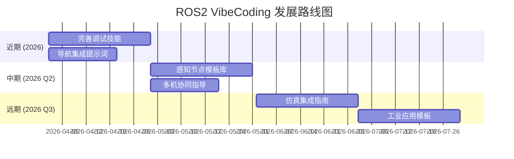

# ROS2 机器人开发 VibeCoding 指南

> 本指南将 VibeCoding 方法论应用于 ROS2 机器人项目开发，涵盖从环境配置、节点开发到部署调试的全流程。

<p align="left">
    
    
    
    
    
</p>

## 📊 仓库活跃度

[](https://star-history.com/#MIUAV/vibe-coding-ros2&Date)

---

## 🖼️ 概览

**ROS2 VibeCoding** 是将 AI 结对编程与机器人开发相结合的终极工作流程。ROS2 项目具有独特的复杂性：

- **多节点通信** — Topic/Service/Action 多种通信机制
- **硬件驱动集成** — 相机、激光雷达、IMU、电机驱动
- **实时性要求** — 控制系统对延迟敏感
- **跨平台部署** — x86 开发机 → ARM 部署机（OrinNX/AGX/JetBot）
- **生态依赖** — Navigation2、MoveIt、ROS2 工业应用

> **核心理念**: *规划驱动 + 上下文固定 + AI 结对执行*，让机器人代码从「难以维护」变成「可审计、可迭代」。

**一句话**: VibeCoding = **规划驱动 + 上下文固定 + AI 结对执行**

---

## 🔑 元方法论 (Meta-Methodology)

### 递归优化循环

VibeCoding 的核心是一个能**自我优化**的 AI 系统：

```
创生 (Bootstrap) → 自省与进化 (Self-Correction) → 创造 (Generation) → 循环与飞跃 (Recursive Loop)
```

### α-Ω 提示词系统

- **α-提示词 (生成器)**: 负责生成其他提示词或技能
- **Ω-提示词 (优化器)**: 负责优化其他提示词或技能

---

## 🧭 道

- **凡是 AI 能做的，就不要人工做** — 重复性代码生成、配置模板、文档编写
- **一切问题问 AI** — 先问 AI，AI 解决不了再人工
- **上下文是 VibeCoding 的第一性要素** — 垃圾进，垃圾出
- **系统性思考：节点、通信、硬件三维度** — 机器人系统的核心是节点间通信和硬件交互
- **数据与函数即是编程的一切** — ROS2 消息即数据，节点即函数
- **输入→处理→输出刻画整个过程** — 节点的本质
- **先结构，后代码** — 规划好框架，不然后面技术债还不完
- **奥卡姆剃刀定理** — 如无必要，勿增代码
- **帕累托法则** — 关注重要的 20%
- **重复，多试几次** — 实在不行重新开个窗口
- **专注** — 极致的专注可以击穿代码，一次只做一件事

---

## 🧩 法

- **一句话目标 + 非目标** — 明确本次开发要做什么、不做什么
- **正交性** — 功能不要太重复，模块职责清晰
- **能抄不写** — 不重复造轮子，先问 AI 有没有合适的仓库
- **官方文档优先** — 先把官方文档喂给 AI
- **按职责拆模块** — 感知、规划、控制、执行分离
- **接口先行，实现后补** — 先定义 msg/srv/action，再实现节点
- **一次只改一个模块** — 降低耦合风险
- **文档即上下文** — 不是事后补，而是开发时同步写

---

## 🛠️ 术

- **明确写清**: 能改什么、不能改什么
- **Debug 法则**: 预期 vs 实际 + 最小复现 + 关键日志
- **测试分层**: 单元测试、集成测试、硬件测试
- **代码一多就切会话** — 保持上下文清晰
- **逆向思考** — 从需求逆向构建代码

### 可执行工具（v0.0.1-beta 新增）

本项目不仅有文档，还有**可直接运行**的脚本：

| 工具 | 路径 | 说明 |
|------|------|------|
| `ros2-package-generator.sh` | `scripts/generators/` | 一键生成标准 ROS2 包（CMakeLists.txt + package.xml + launch 骨架） |
| `ros2-node-validator.sh` | `scripts/validators/` | 检查 C++ 代码的智能指针/QoS/Executor 规范 |
| `check_ros2_package.sh` | `scripts/` | 通用包结构验证（depend/ament/install） |
| `ros2-build.yml` | `.github/workflows/` | CI 自动化：5 个 job 验证文档、脚本、Python、Shell、AGENTS |

```bash
# 示例：生成一个 ROS2 包
bash scripts/generators/ros2-package-generator.sh my_control cpp rclcpp,std_msgs,geometry_msgs

# 示例：验证节点代码
bash scripts/validators/ros2-node-validator.sh src/my_control_node.cpp

# 示例：检查包结构
bash scripts/check_ros2_package.sh my_control
```

### 嵌入式平台 Debug（容器/仿真 → 实机部署）

| 阶段 | 环境 | Debug 手段 |
|------|------|-----------|
| **容器内 Debug** | x86 Docker / ARM Docker | `ros2 topic echo`、`rqt`、`ros2 bag` 录制分析 |
| **仿真器验证** | Gazebo / Ignition | 仿真器内节点通信监控、`ros2 doctor` |
| **实机部署** | Jetson OrinNX / RDK-X5 / 旭日X3 | SSH 远程连接、网络抓包（`tcpdump`）、远程 GDB / GDBServer |
| **跨平台对比** | 容器 vs 实机 | 确认时钟源（`/use_sim_time`）、话题带宽、延迟差异 |

> **工作流**: 容器内开发调试 → 仿真器验证功能 → 交叉编译部署到实机 → SSH 远程 Debug
> **关键点**: 实机与容器环境的差异主要在时钟源（仿真用 `/use_sim_time`）、硬件驱动依赖、网络配置

---

## 📋 工具链

### 集成开发环境 (IDE) & 终端

| 工具 | 用途 | 备注 |
|------|------|------|
| **[VS Code](https://code.visualstudio.com/)** | 主 IDE | + ROS 扩展 |
| **[Cursor](https://cursor.com/)** | AI 增强开发 | VS Code 分支 |
| **[Docker](https://www.docker.com/)** | 容器化开发 | ARM 交叉编译必备 |
| **[Terminator](https://gnome-terminator.org/)** | 多终端管理 | 分屏操作 |
| **[tmux](https://github.com/tmux/tmux)** | 会话保持 | 服务器开发必备 |
| **[Warp](https://www.warp.dev/)** | AI 终端 | 现代化终端 |

### ROS2 开发工具

```bash
# 核心工具
sudo apt install -y ros-humble-ros2launch ros-humble-ros2run ros-humble-ros2pkg
sudo apt install -y ros-humble-rqt* ros-humble-rviz2
sudo apt install -y python3-colcon-common-extensions

# 调试工具
sudo apt install -y ros-humble-ros2bag ros-humble-ros2cli
sudo apt install -y ros-humble-topic-monitoring
sudo apt install -y ros-humble-diagnostics

# 仿真工具
sudo apt install -y ros-humble-gazebo-ros-pkgs ros-humble-turtlebot3-*
```

### AI 模型 & 服务 (2026年4月 SOTA)

| 梯队 | 模型 | 适用场景 |
|------|------|----------|
| **第一梯队** | Claude 3.7 Sonnet / GPT-4o / o3 / Gemini 2.0 Ultra / Kimi K2.5 / Qwen 3.5 / Minimax-M2.7 | 机器人架构设计、运动控制算法、导航规划、感知融合、多模态交互、仿真调试 |
| **第二梯队** | Codex 5.5-max / Grok-3 / Qwen 3.5 / Doubao-Pro / Seed-Code 2.0 / DeepSeek V3.2 / Llama 4 | 节点代码生成、传感器驱动、控制器实现、SLAM算法、ROS2集成、边缘部署 |
| **第三梯队** | Mistral Large / Gemini 2.0 Flash / Hunyuan-T1 / Ernie-4.5 / Qwen 3 MoE / DeepSeek-Coder-V3 / SWE-1-Max / Tongyi-Qwen-VL / Yi-VL | 视觉里程计、目标检测、图像分割、模型量化加速、代码补全、Bug修复 |

> **2026年4月要点**: GPT-4o / o3 / Claude 3.7 Sonnet / Gemini 2.0 Ultra 引领多模态融合，Kimi K2.5 / Qwen 3.5 / Minimax-M2.7 在机器人开发场景达到国际第一梯队水平

---

## ⚙️ 核心技能 (Skills)

本项目定义了以下专用技能：

| 技能 | 描述 | 触发词 |
|------|------|--------|
| **ros2-package-generator** | ROS2 功能包生成 | "创建 ROS2 包" / "generate ros2 package" |
| **arm64-cross-compile** | ARM64 交叉编译 | "交叉编译" / "ARM 编译" |
| **ros2-debugging** | ROS2 调试技能 | "调试 ROS2" / "ros2 debug" |
| **ros2-docker-dev** | Docker 开发环境 | "ROS2 Docker" |
| **ros2-navigation** | 导航系统集成 | "navigation" / "nav2" |
| **ros2-perception** | 感知节点开发 | "perception" / "detect" |

详见 `skills/` 目录。

---

## 📚 文档结构

```
vibe-coding-ros2/
├── README.md                      # 本指南入口
├── publish.sh                     # 发布脚本
├── agents/                        # Agent 主目录
│   ├── documents/                 # 方法论与原则文档
│   │   ├── Methodology_and_Principles/
│   │   ├── Templates_and_Resources/
│   │   └── Tutorials_and_Guides/
│   ├── prompts/                   # AI 提示词库
│   │   ├── coding_prompts/
│   │   ├── system_prompts/
│   │   └── user_prompts/
│   ├── robots/                    # 机器人类型指南
│   │   ├── common/
│   │   ├── wheeled_vehicle/
│   │   ├── quadruped/
│   │   ├── manipulator/
│   │   ├── humanoid/
│   │   └── multi_rotor_uav/
│   ├── skills/                    # 技能定义
│   │   ├── ros2-package-generator/SKILL.md
│   │   ├── arm64-cross-compile/SKILL.md
│   │   └── ros2-debugging/SKILL.md
│   └── memory-bank/               # Memory Bank 模板
│       ├── project-context.md
│       ├── implementation-plan.md
│       └── progress.md
└── i18n/                          # 多语言文档
    ├── README.md
    ├── en/
    │   ├── README.md
    │   └── CHANGELOG.md
    └── zh-CN/
        ├── README.md
        └── CHANGELOG.md
```

---

## 🚀 快速入门

### Step 0: 一键初始化 AI 规则与技能导入

```bash
./init-agent.sh --target all
```

说明:
- `--target all`: 同时生成 VS Code Copilot 与 Cursor 配置
- `--target copilot`: 仅生成 Copilot 配置
- `--target cursor`: 仅生成 Cursor 配置

脚本会自动生成:
- Copilot 指令文件: `.github/copilot-instructions.md`
- Cursor 规则文件: `.cursor/rules/vibe-coding-ros2.mdc`
- MCP 配置模板: `.vscode/mcp.json` 与 `.cursor/mcp.json`
- 全量技能索引: `agents/generated/skill-index.md`
- 项目准则索引: `agents/generated/context-index.md`

### Step 1: 选择 AI 工具

推荐使用 **Claude Opus 4.5** (VS Code Copilot) 或 **Codex CLI**

### Step 2: 创建 Memory Bank

```bash
mkdir -p memory-bank
# 复制模板或让 AI 生成
```

### Step 3: 定义项目上下文

```markdown
# 项目上下文 - [项目名称]

## 1. 项目概述
- 机器人平台: [ Jetson OrinNX / AGX / x86 ]
- ROS2 发行版: Humble
- 核心功能: [列表]

## 2. 技术栈
- 语言: C++ / Python
- 关键依赖: OpenCV, TensorRT, Navigation2...

## 3. 包结构
[包列表及职责]

## 4. 消息流
[传感器] → [感知] → [规划] → [控制] → [执行器]
```

### Step 4: AI 结对开发

```
"请阅读 memory-bank 所有文档，帮我实现实施计划第 1 步"
```

---

## 📖 详细文档

| 分类 | 文档 | 内容 |
|------|------|------|
| 入门 | [开发经验](./documents/Methodology_and_Principles/development-experience.md) | ROS2 开发坑点与经验 |
| 方法论 | [架构原则](./documents/Methodology_and_Principles/ros2-architecture-principles.md) | 节点设计、通信模式 |
| 模板 | [项目模板](./documents/Templates_and_Resources/ros2-project-template.md) | 标准项目结构 |
| 模板 | [Memory Bank](./documents/Templates_and_Resources/memory-bank-template.md) | 上下文文档模板 |
| 指南 | [调试指南](./documents/Tutorials_and_Guides/ros2-debug-guide.md) | rqt, bag, launch 调试 |
| 指南 | [Docker 配置](./documents/Tutorials_and_Guides/docker-setup-guide.md) | 容器开发环境 |
| 指南 | [交叉编译](./documents/Tutorials_and_Guides/cross-compile-guide.md) | ARM64 编译 |
| 指南 | [Agent 导入指南](./i18n/zh-CN/AGENT_IMPORT_GUIDE.md) | AI 工具加载技能与提示 |

---

## 🗺️ 路线图



---

## 🤝 参与贡献

欢迎提交 Issue 和 Pull Request！

---

*本项目参考 [vibe-coding-cn](https://github.com/2025Emma/vibe-coding-cn) 构建*
